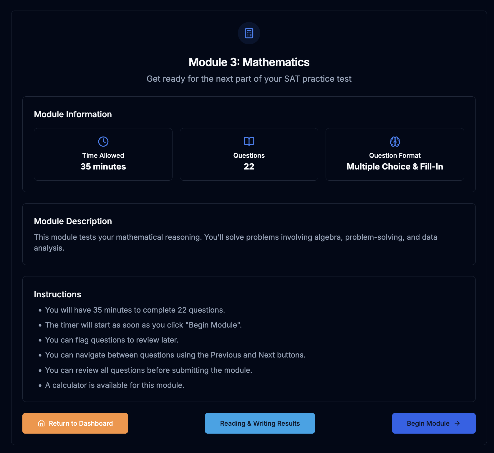
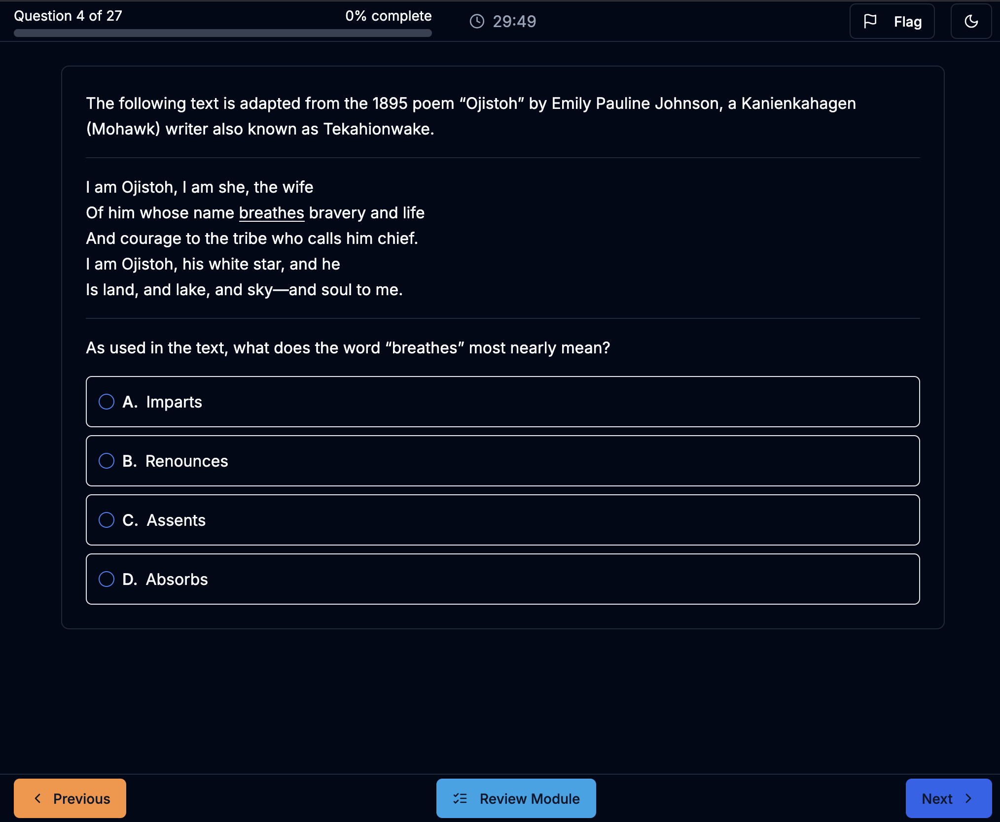
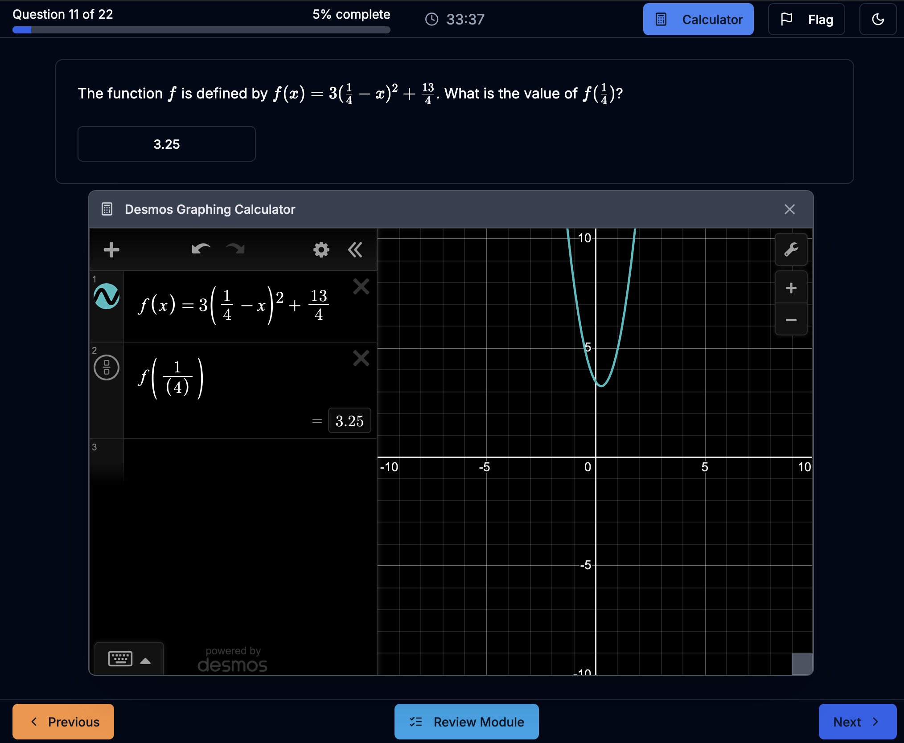
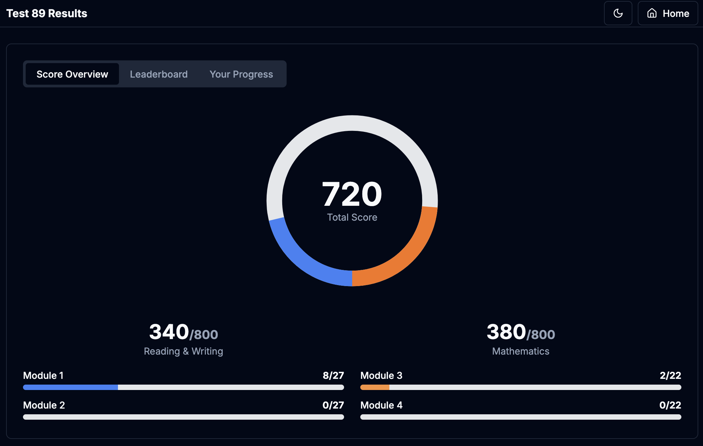
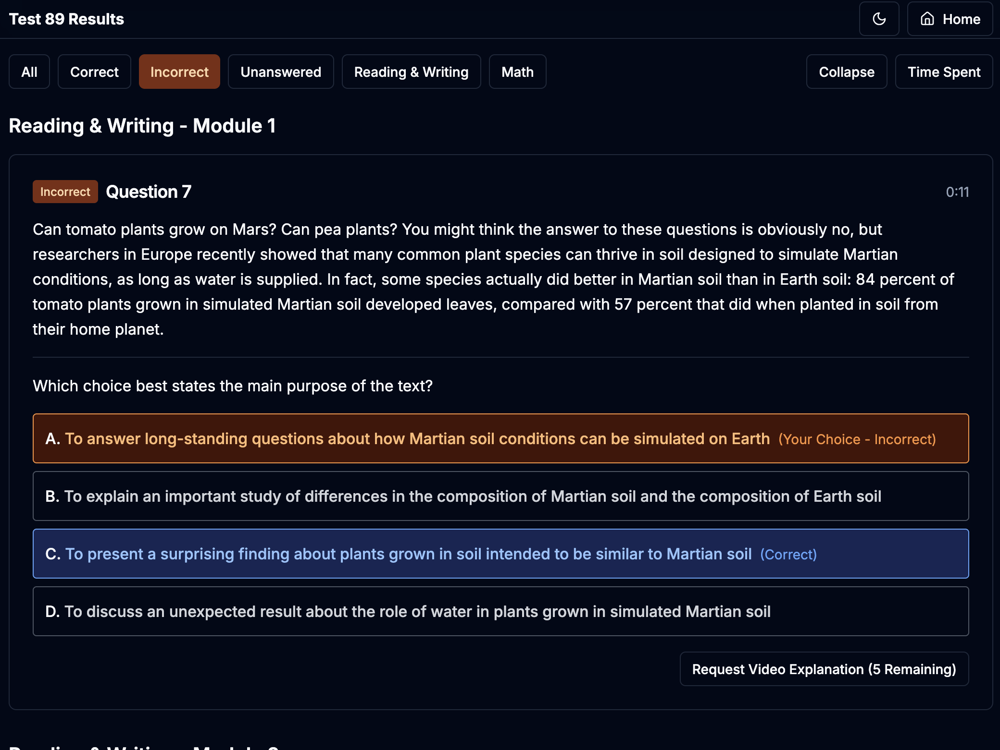
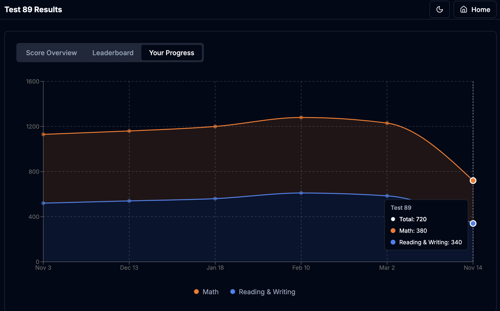
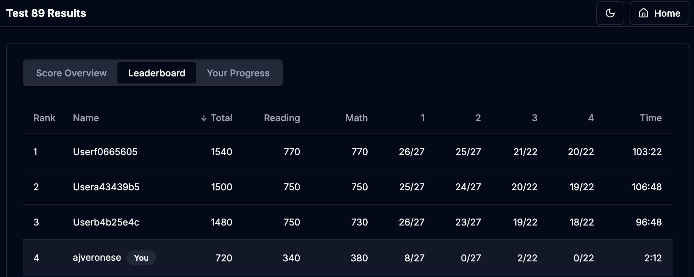

# skoon. - Digital SAT Practice Platform

A full-stack web application providing an authentic Digital SAT testing experience with adaptive modules, real-time scoring, and comprehensive performance analytics.

## 🎯 Overview

skoon. is a modern SAT preparation platform that replicates the official Digital SAT format, featuring adaptive testing algorithms, detailed performance tracking, and competitive leaderboards. Built with Next.js 14 and Supabase, it delivers a seamless, responsive testing experience.

## 📸 Screenshots

### Test Taking Experience


*Module introduction screen with instructions and time limits*



*Reading & Writing question with clean, distraction-free interface*



*Math question with integrated Desmos graphing calculator*


*Module review screen showing answered and flagged questions*


### Results Dashboard


*Comprehensive score breakdown with section scores and performance metrics*



*Detailed question review with filters and answer explanations*



*Interactive progress visualization showing performance trends over time*



*Competitive leaderboard with sortable columns and user comparison*

## ✨ Key Features

### 📝 Authentic Testing Experience
- **Adaptive Module System**: Four-module structure (Reading & Writing modules 1-2, Math modules 3-4) with difficulty adaptation based on first module performance
- **Realistic Question Types**: Multiple choice and free-response math questions with full LaTeX/KaTeX rendering
- **Integrated Calculator**: Built-in graphing calculator (powered by Desmos) for math sections
- **Time Tracking**: Per-question and per-module timing with detailed analytics

### 📊 Performance Analytics
- **Comprehensive Score Reports**: SAT-scaled scores (400-800) for Reading & Writing and Math sections
- **Question Review Interface**: Detailed breakdown of correct/incorrect answers with full question content
- **Filter System**: Smart filtering by correctness, difficulty, topics, and question types
- **Progress Visualization**: Interactive charts showing performance trends over time

### 🏆 Competitive Features
- **Real-time Leaderboards**: Section-specific (Reading & Writing, Math, Full Test) rankings
- **Dynamic Sorting**: Sortable by total score, section scores, module performance, and completion time
- **User Comparison**: Sticky user row for easy self-comparison against top performers

### 🎨 Modern UI/UX
- **Responsive Design**: Optimized for desktop and tablet testing experiences
- **Dark/Light Mode**: Full theme support with system preference detection
- **Clean Interface**: Distraction-free testing environment with intuitive navigation
- **Smooth Animations**: Polished transitions and loading states

## 🛠️ Technology Stack

### Frontend
- **Framework**: Next.js 14 (App Router)
- **Language**: TypeScript
- **Styling**: Tailwind CSS
- **UI Components**: shadcn/ui component library
- **State Management**: React Hooks
- **Math Rendering**: react-katex
- **Charts**: Recharts
- **Calculator**: Desmos API

### Backend
- **Database**: Supabase (PostgreSQL)
- **Authentication**: Supabase Auth (ready for implementation)
- **Real-time**: Supabase Realtime subscriptions
- **Storage**: JSONB for flexible module data storage

### Key Libraries
- `@supabase/supabase-js` - Database client
- `lucide-react` - Icon library
- `sonner` - Toast notifications
- `react-katex` - Mathematical notation rendering
- `katex` - LaTeX rendering engine

## 📁 Project Structure

```
skoon./
├── app/                          # Next.js app router
│   ├── test/
│   │   ├── module/[id]/         # Test module pages
│   │   │   ├── intro/           # Module introduction
│   │   │   └── review/          # Module review
│   │   ├── new/                 # New test creation
│   │   └── results/             # Results dashboard
│   ├── layout.tsx               # Root layout
│   └── page.tsx                 # Home page
├── components/
│   ├── test-module/             # Core testing components
│   │   ├── EnglishModuleRunner.tsx
│   │   ├── MathModuleRunner.tsx
│   │   └── TestModuleShell.tsx
│   ├── ui/                      # shadcn/ui components
│   └── rendered-content.tsx     # Content renderer with LaTeX
├── lib/
│   ├── supabase/                # Database queries
│   │   ├── client.ts
│   │   ├── questions.ts
│   │   └── test-attempts.ts
│   ├── auth.ts                  # Authentication utilities
│   ├── scoring.ts               # SAT scoring algorithm
│   ├── test-data.ts             # Test data management
│   └── types.ts                 # TypeScript types
├── types/
│   └── db.ts                    # Database type definitions
└── supabase/                    # Database scripts
    ├── populate_leaderboard.sql
    └── full_db.json
```

## 📊 Database Schema

### Tables

**questions**
- Stores all SAT questions with content arrays, answer choices, correct answers
- Organized by test_id, module_number, and question_number
- Includes difficulty ratings and video explanation tracking

**test_attempts**
- Stores user test submissions with JSONB modules structure
- Tracks user answers, time spent per question, and correctness
- Calculates and stores scaled scores (Reading & Writing, Math, Total)

**users**
- User profiles with email, username, role
- Supports student/teacher/admin roles
- Tracks gems balance for gamification features

## 🎯 Key Features Implementation

### Adaptive Testing Algorithm
The platform implements College Board's adaptive testing logic:
- Module 1 performance determines Module 2 difficulty
- Module 3 performance determines Module 4 difficulty
- Scoring tables adjust based on module difficulty levels

### Section-Based Filtering
Results page supports three views via URL parameters:
- `?section=full` - Complete test results
- `?section=rw` - Reading & Writing only (blue theme)
- `?section=math` - Math only (orange theme)

### Real-time Score Calculation
- Uses official SAT scoring conversion tables
- Accounts for adaptive module difficulty
- Provides instant feedback on test completion

## 🔒 Security & Performance

- Server-side rendering for optimal performance
- Client-side state management for interactive features
- Row-level security policies (ready for implementation)
- Optimized database queries with proper indexing

## 🎨 Design Philosophy

- **Authenticity**: Matches the official Digital SAT interface and experience
- **Accessibility**: Keyboard navigation, screen reader support, high contrast mode
- **Performance**: Fast load times, smooth animations, optimized bundle size
- **Scalability**: Modular architecture supporting multiple tests and question types

## 📈 Future Enhancements

- [ ] User authentication and profile management
- [ ] Video explanations for questions
- [ ] Custom practice sets by topic
- [ ] Teacher dashboard for student tracking
- [ ] Mobile app (React Native)
- [ ] AI-powered study recommendations
- [ ] Social features (study groups, challenges)

## 🤝 Contributing

This is a portfolio project, but suggestions and feedback are welcome! Feel free to open an issue or reach out directly.

## 📄 License

This project is for educational and portfolio purposes. SAT® is a trademark registered by the College Board, which is not affiliated with, and does not endorse, this product.

## 👨‍💻 Developer

**Aaron Veronese**

Built as a demonstration of full-stack development capabilities including:
- Modern React/Next.js architecture
- TypeScript for type safety
- Supabase for backend infrastructure
- Complex state management
- Responsive UI/UX design
- Database design and optimization
- Algorithm implementation (adaptive testing, scoring)

---

*This project showcases proficiency in building production-ready web applications with modern technologies and best practices.*

## 📄 PDF parsing scripts

There are scripts to extract questions from practice PDF files and convert them to a JSON format suitable for importing into the database.

Usage:
```
npm run parse:pdf -- ./public/testpdf/PRACTICE\ TEST\ 90.pdf --testId=90 --out=parsed_90.json
node scripts/json_to_sql.js parsed_90.json > update_questions.sql
```

Notes: The parsing is heuristic and needs manual validation; it will not extract images. Use the exported SQL to update the `questions` table in Supabase.
